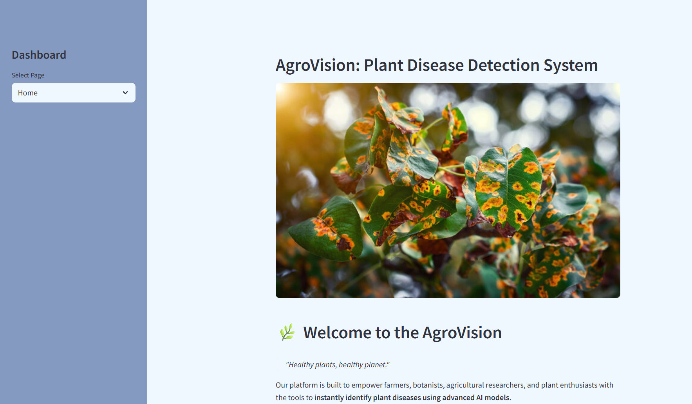
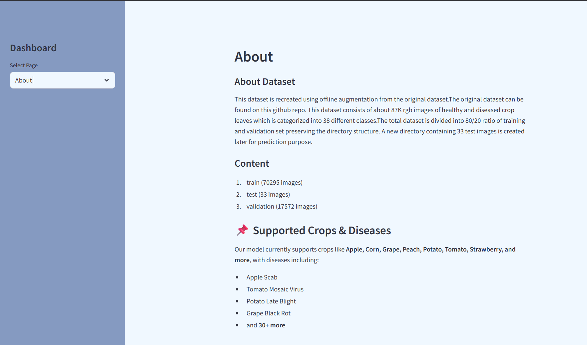
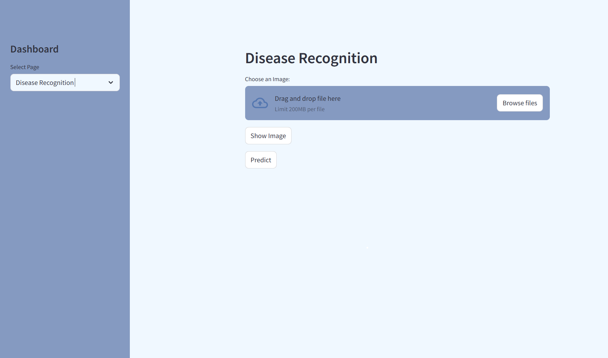
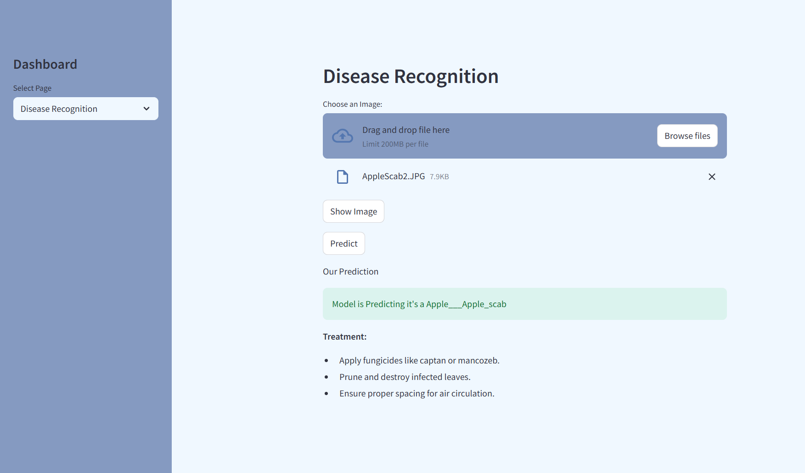

# 🌿 Plant Disease Recognition System

A deep learning-based system that detects plant leaf diseases using a trained TensorFlow model and an interactive Streamlit web app. This project uses image classification techniques to identify the disease from leaf images and suggests possible treatments.

---

## 🚀 Features

- 🌱 Identify plant leaf diseases using a trained CNN model
- 📊 Streamlit web interface for easy interaction
- 🧠 TensorFlow model trained on labeled plant disease images
- 🧾 JSON-based solution recommendations
- 📂 Structured, clean, and GitHub-ready project

---

## 🧪 Model Information

- Model Type: Convolutional Neural Network (CNN)
- Input Shape: 128x128 RGB images
- File: `trained_plant_disease_model.keras` (~90 MB)
- Framework: TensorFlow 2.17.0

---
## 📸 Screenshots

### 🏠 Home Page
Displays the app's homepage with header and overview image.



---

### ℹ️ About Page
Explains the dataset, supported crops, and how the model predicts diseases from uploaded leaf images.



---

### 📤 Upload Page
Users can upload a plant leaf image to predict the disease.



---

### 📈 Prediction Result
After uploading, the app displays:
- The predicted disease class
- The original image
- A recommended solution from the JSON file



## 🗃️ Project Structure

```
plant-disease-detection/
├── assets/                  # Images (e.g., homepage display)
├── data/                    # Folder for train/valid/test datasets (not included)
├── model/                   # Trained model and training history
├── notebooks/               # Jupyter notebooks for training & testing
├── src/                     # Main Streamlit app
├── disease_solutions.json   # JSON mapping for disease solutions
├── requirements.txt         # Python dependencies
├── .gitignore               # Files/folders ignored by Git
└── README.md                # You're here
```

---

## 📁 Dataset

The dataset used for training and testing is not included in this repository due to size limitations.

📥 **[Download Dataset][(https://www.kaggle.com/datasets/vipoooool/new-plant-diseases-dataset)]**

After downloading, place the folders in this structure:
```
plant-disease-detection/
└── data/
    ├── train/
    ├── valid/
    └── test/
```
---

## 🖥️ Installation & Running

### 1️⃣ Clone the Repository
```
git clone https://github.com/Madhuril-Bhaskar/Plant-Disease-Recognition.git
cd Plant-Disease-Recognition
```

2️⃣ Create a Virtual Environment (optional but recommended)
```
python -m venv .venv
source .venv/bin/activate        # Linux/macOS
.venv\Scripts\activate           # Windows
```

3️⃣ Install Dependencies
```
pip install -r requirements.txt
```

4️⃣ Run the Web App
```
cd src
python -m streamlit run main.py
```

### 🔒 License
-----------
This project is licensed under the MIT License.

